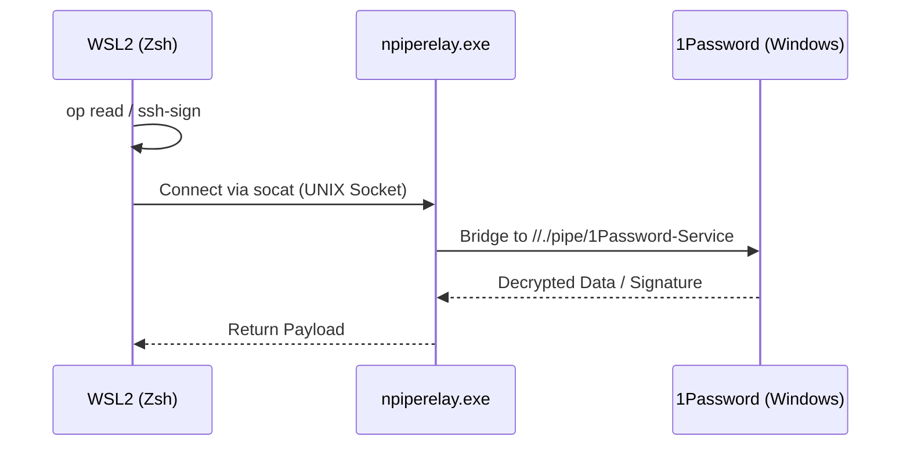

# Engineering Specification

This document defines the technical logic and constraints of the Deterministic Infrastructure Engine.

## System Lifecycle

The provisioning process follows a strict tiered model to resolve dependencies without circularity or speculation.

### Tiered Execution Model

| Phase       | Definition               | Mechanism                                                                                                    |
| :---------- | :----------------------- | :----------------------------------------------------------------------------------------------------------- |
| **Tier -2** | Infrastructure Assertion | Manual setup of 1Password schema, FDA, and Sudoers.                                                          |
| **Tier -1** | Identity Relay           | [`.bootstrap-identity.sh`](./.bootstrap-identity.sh) provisions `mise` and establishes the 1Password bridge. |
| **Tier 0**  | Hermetic Convergence     | `mise` pins `chezmoi` and `op` to repo-defined versions.                                                     |
| **Tier 1**  | System Provisioning      | Phase 10 scripts install Homebrew (macOS) or APT/DNF (Linux) packages.                                       |
| **Tier 2**  | Runtime Convergence      | Phase 20 scripts provision language runtimes and Neovim providers via absolute paths.                        |
| **Tier 3**  | Trust Aggregation        | Phase 50+ scripts extract SSH keys and generate Git `allowed_signers`.                                       |

### De-provisioning (Purge) Sequence

To reverse the infrastructure state and restore the host to a clean environment, execute the following steps in order. This process adheres to the "Inverse Function" principle of managed infrastructure.

#### 1. Selective Managed State Removal

Remove only the files and directories explicitly managed by the engine. This minimizes impact on unmanaged local data.

```zsh
# Remove managed targets relative to HOME
chezmoi managed --path-style absolute -0 | xargs -0 rm -rf --

# Remove chezmoi's own configuration and source state
chezmoi purge
```

#### 2. Platform-Specific Teardown

**macOS (Apple Silicon)**:

- **Package Force-Sync**: Remove all brews, casks, and taps not defined in the managed Brewfile.
  ```zsh
  brew list --cask | xargs -I {} brew uninstall --cask --zap {}
  NONINTERACTIVE=1 /bin/bash -c "$(curl -fsSL https://raw.githubusercontent.com/Homebrew/install/HEAD/uninstall.sh)"
  sudo rm -rf /opt/homebrew
  ```
- **TCC Revocation**: Manually revoke "Full Disk Access" for the terminal emulator in System Settings.

**WSL2 (Ubuntu)**:

- **Service Termination**: Stop and disable the user-level identity bridge.
  ```zsh
  systemctl --user disable --now 1password-bridge.service
  rm -f "$HOME/.1password/agent.sock"
  ```
- **Shell Reversion**: Restore the default system shell.
  ```zsh
  sudo chsh -s /bin/bash $USER
  ```

#### 3. Local State Wipe (Optional / Aggressive)

> [!WARNING]
> The following command permanently deletes all application configurations, local data, and caches (including shell history). Execute only if a total environment reset is required.

```zsh
rm -rf "$HOME/.config" "$HOME/.local" "$HOME/.cache"
```

### Identity Bridge Sequence (WSL2)

The engine utilizes `npiperelay` and `socat` to bridge the WSL2 UNIX socket to the Windows 1Password Named Pipe.



## Context-Aware Identity Routing

The engine enforces a zero-trust identity model using Git [`includeIf`](https://git-scm.com/docs/git-config#Documentation/git-config.txt-includeIfconditionpath) directives. Identity routing is directory-based and deterministic.

- **Discovery Logic**: `chezmoi` filters 1Password SSH Key items by the `dotfiles-ssh-key` tag.
- **Dynamic Scoping**: For each identified item, the engine extracts the `dotfiles` section fields (`dotfiles_git_name`, `dotfiles_git_email`, `dotfiles_git_dirs`) to generate scoped `includeIf` directives.
- **Security**: No global `user.email` is defined. Git operations outside mapped directories will fail, preventing identity leakage.

## Filesystem Standards

The environment strictly adheres to the XDG Base Directory Specification to ensure a clean `$HOME`.

| Category   | Path             | Purpose                                           |
| :--------- | :--------------- | :------------------------------------------------ |
| **Config** | `~/.config`      | Static configuration files (Read-Only source).    |
| **Data**   | `~/.local/share` | Persistent application data and shims.            |
| **State**  | `~/.local/state` | Persistent but variable metadata (e.g., history). |
| **Cache**  | `~/.cache`       | Ephemeral data and generated completions.         |

## Rationale for [`.bootstrap-identity.sh`](./.bootstrap-identity.sh)

The Tier -1 script exists because `chezmoi` templates cannot be evaluated before the toolchain itself is converged. By temporarily re-routing `XDG_CONFIG_HOME`, the engine forces `mise` to process only the local Tier 0 configuration, ensuring an invariant starting state for the rest of the application.
